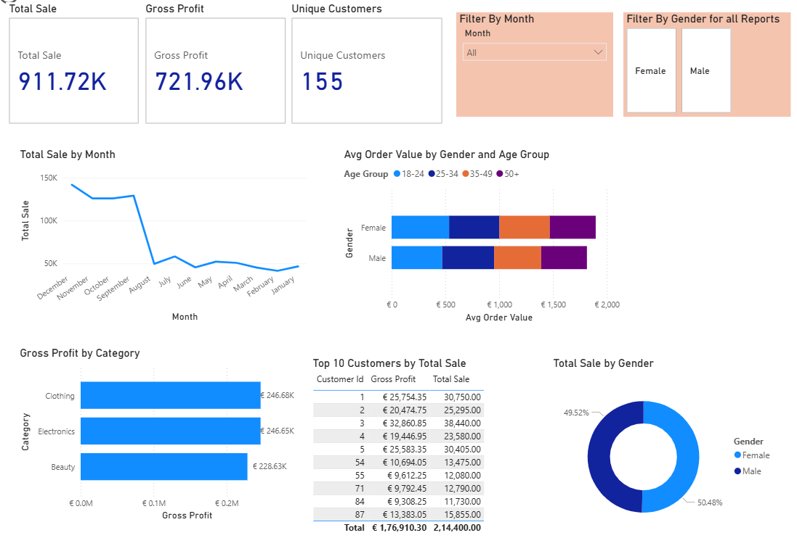
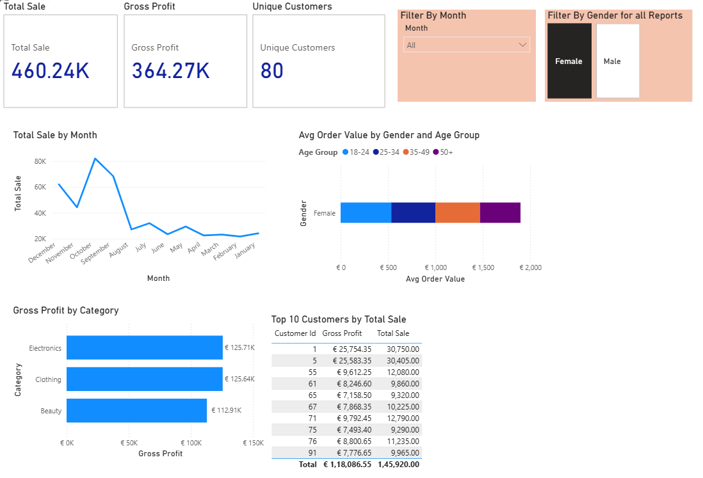
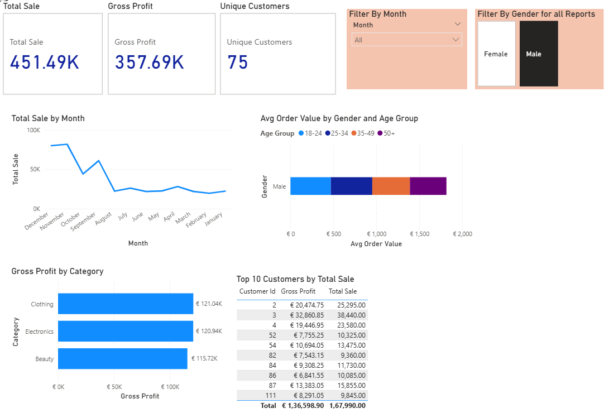
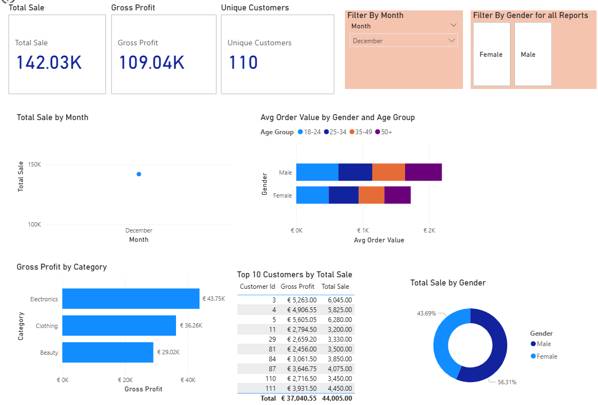
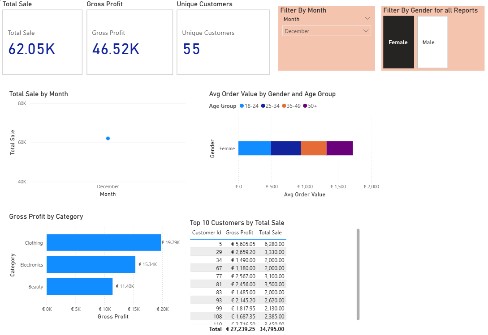
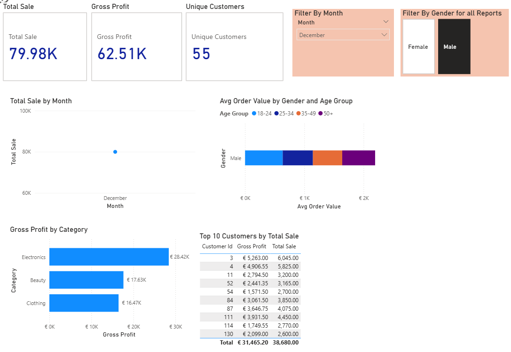
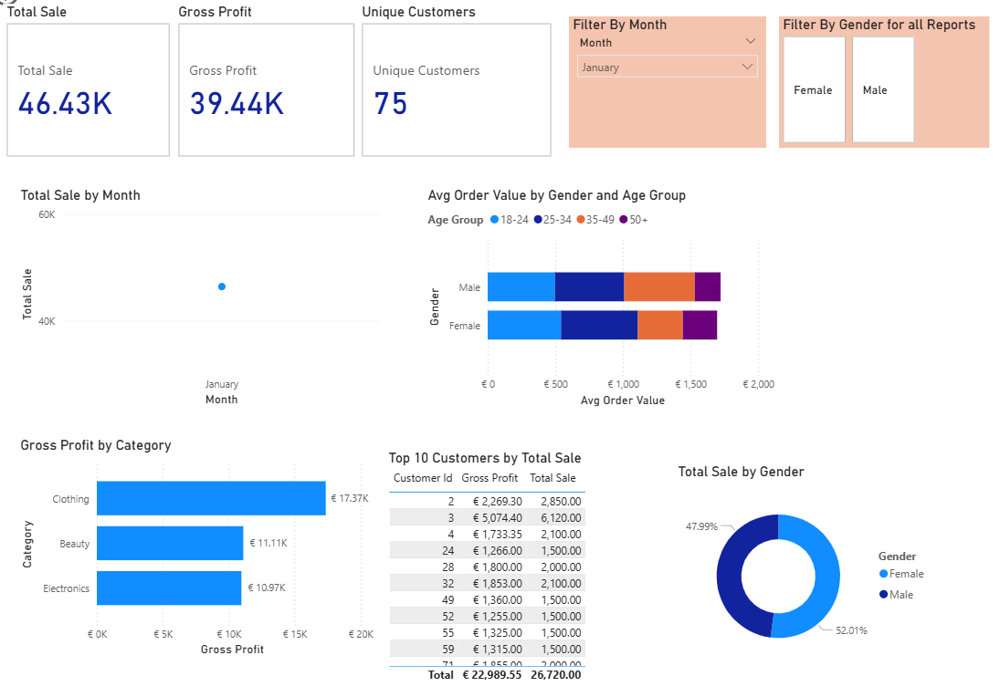

# Retail Sales Analysis SQL and Power BI Project

## Project Overview

**Project Title**: Retail Sales Analysis  
**Level**: Beginner  
**Database**: `Sql_Project_P1`

This project shows SQLand Power BI skills by setting up a retail sales database, exploring the data, cleaning it, and answering business questions with queries.

## Objectives

1. **Set up a retail sales database**: Create and populate a retail sales database with the provided sales data.
2. **Data Cleaning**: Identify and remove any records with missing or null values.
3. **Exploratory Data Analysis (EDA)**: Perform basic exploratory data analysis to understand the dataset.
4. **Business Analysis**: Use SQL to answer specific business questions and derive insights from the sales data.
5. **Power BI Reports**: Build a dynamic, one-page dashboard in Power BI to visually track core sales KPIs like Total Revenue and Profit Margin.

## Project Structure

### 1. Database Setup

- **Database Creation**: The project starts by creating a database named `Sql_Project_P1`.
- **Table Creation**: A table named `Retail_sales` is created to store the sales data. The table structure includes columns for transaction ID, sale date, sale time, customer ID, gender, age, product category, quantity sold, price per unit, cost of goods sold (COGS), and total sale amount.

```sql
CREATE DATABASE p1_retail_db;

CREATE TABLE Retail_Sales (
transactions_id INT PRIMARY KEY, 
sale_date DATE,
sale_time TIME,
customer_id	INT,
gender VARCHAR(10),
age	INT,
category VARCHAR(15),
quantiy	INT,
price_per_unit FLOAT,
cogs FLOAT,
total_sale FLOAT
);
```

### 2. Data Exploration & Cleaning

- **Record Count**: Determine the total number of records in the dataset.
- **Customer Count**: Find out how many unique customers are in the dataset.
- **Category Count**: Identify all unique product categories in the dataset.
- **Null Value Check**: Check for any null values in the dataset and delete records with missing data.

```sql
SELECT count(*) FROM Retail_Sales;
SELECT COUNT(DISTINCT customer_id) FROM Retail_Sales;
SELECT DISTINCT category FROM Retail_Sales;

SELECT * FROM Retail_Sales 
WHERE 
transactions_id IS NULL OR sale_date IS NULL OR sale_time IS NULL OR
customer_id IS NULL OR gender IS NULL OR age IS NULL OR 
category IS NULL OR quantity IS NULL OR price_per_unit IS NULL OR
cogs IS NULL OR total_sale IS NULL;

DELETE FROM Retail_sales
WHERE 
transactions_id IS NULL OR sale_date IS NULL OR sale_time IS NULL OR
customer_id IS NULL OR gender IS NULL OR age IS NULL OR 
category IS NULL OR quantity IS NULL OR price_per_unit IS NULL OR
cogs IS NULL OR total_sale IS NULL;
```
2.1 **Renaming the Column name from quantiy to quantity**:

```sql
 ALTER TABLE Retail_sales 
 RENAME COLUMN quantiy to quantity;
```

### 3. Data Analysis & Findings

The following SQL queries were developed to answer specific business questions:

3. **Write a SQL query to retrieve all columns for sales made on '2023-1-25**:
```sql
SELECT * FROM Retail_sales 
WHERE sale_date ='2023-1-25';
```

4. **Write a SQL query to retrieve all transactions where the category is 'Clothing' and the quantity sold is more than 3 in the month of May-2023**:
```sql
SELECT * FROM Retail_sales 
WHERE category ='clothing'AND 
quantity >= 3 AND 
YEAR(sale_date)=2023 AND
MONTH(sale_date) =05;

```

5. **Write a SQL query to calculate the total sales (total_sale) for each category.**:
```sql
SELECT category , 
SUM(total_sale) as net_sale,
COUNT(*) AS Total_Orders
FROM Retail_sales GROUP BY category;
```

6. **Write a SQL query to find the average age of customers who purchased items from the 'Electronics' category.**:
```sql
SELECT ROUND(AVG(age) , 2) AS Avg_age ,category
FROM Retail_sales 
WHERE category ='Electronics';
```

7. **Write a SQL query to find all transactions where the total_sale is greater than 1500.**:
```sql
SELECT * FROM Retail_sales 
WHERE total_sale>1500;
```

8. **Write a SQL query to find the total number of transactions (transaction_id) made by each gender in each category.**:
```sql
SELECT category, 
COUNT(*) AS Total_transactions,
gender AS Gender 
FROM Retail_sales 
GROUP BY category,Gender
ORDER BY 1;
```

9. **Write a SQL query to calculate the average sale for each month.**:
```sql
SELECT 
YEAR(sale_date) year, 
MONTH(sale_date) month, 
ROUND(AVG(total_sale),3) avg_sales
FROM Retail_sales GROUP BY 1,2
 ORDER BY year DESC;
```

10. **Find out best selling month in each year**:
```sql
SELECT year,month,avg_sales
FROM(
SELECT
YEAR(sale_date) year,
MONTH(sale_date) month,
AVG(total_sale) avg_sales,
RANK() OVER(PARTITION BY YEAR(sale_date) ORDER BY AVG(total_sale) desc) as year_rank
FROM Retail_sales
GROUP BY 1,2) t1 
WHERE year_rank=1;
```
11. **Write a SQL query to find the top 10 customers based on the highest total sales **:
```sql
SELECT customer_id ,SUM(total_sale) AS Total_sales
FROM Retail_sales 
GROUP BY 1
ORDER BY 2 DESC
LIMIT 10;
```
12. **Write a SQL query to find the unique customers who purchased items from each category.**:
```sql
SELECT DISTINCT(customer_id) , category
FROM Retail_sales
WHERE category IN('Beauty','Clothing','Electronics')
ORDER BY Customer_id;

13. **Write a SQL query to find the number of unique customers who purchased items from each category.**:
```sql
SELECT 
COUNT(DISTINCT customer_id) count_unq_customer,
category 
FROM Retail_sales
GROUP BY category;
```

14. **Write a SQL query to create each shift and number of orders (Example Morning <12, Afternoon Between 12 & 17, Evening >17)**:
```sql
SELECT 
  CASE 
    WHEN HOUR(sale_time) < 12 THEN 'Morning'
    WHEN HOUR(sale_time) BETWEEN 12 AND 17 THEN 'Afternoon'
    ELSE 'Evening'
  END as shift,
COUNT(*) AS Total_No_Orders
FROM Retail_sales
GROUP BY shift
ORDER BY shift desc;
```
**Power BI Reports**:
<div align="center">

<table style="width:100%;">
<tr>
<td align="center" style="vertical-align: top; padding: 10px;">
<b>1. Overall Sales Summary</b>

</td>
<td align="center" style="vertical-align: top; padding: 10px;">
<b>2. Sales - Female Segment</b>

</td>
<td align="center" style="vertical-align: top; padding: 10px;">
<b>3. Sales - Male Segment</b>

</td>
</tr>

<tr>
<td align="center" style="vertical-align: top; padding: 10px;">
<b>4. Peak Month (December)</b>

</td>
<td align="center" style="vertical-align: top; padding: 10px;">
<b>5. December - Female Sales</b>

</td>
<td align="center" style="vertical-align: top; padding: 10px;">
<b>6. December - Male Sales</b>

</td>
<td align="center" style="vertical-align: top; padding: 10px;">
<b>7. Post-Holiday Dip (January)</b>

</td>
</tr>
</table>
</div>


## Findings

- **Customer Demographics**: The dataset includes customers from various age groups, with sales distributed across different categories such as Clothing and Beauty.
- **Overall Performance**: Total sales were $911.72K with a near-even gender split, though females slightly led the 50.48% Gross Profit margin.
- **Seasonal Trends**: The December sales period was a peak month ($142.03K), followed by a sharp post-holiday dip in January ($46.43K).
- **Customer Behavior**: Both genders primarily buy Clothing and Electronics, while males had higher overall spending in December ($79.98K).

## Reports

- **Comprehensive Performance Dashboard**: A dynamic, one-page Power BI dashboard visually summarizing overall sales, profitability (721.96K Gross Profit), and customer metrics (155 unique customers).
- **Gender and Time-Series Analysis**:  Reports designed with interactive slicers to analyze sales trends over time and compare purchasing behavior, spending, and category preferences between male and female customer segments..
- **Customer and Category Deep Dives**: Detailed visuals tracking the Top 10 Customers by total sale and charting Gross Profit performance across core product categories (Clothing, Electronics, and Beauty).
- 
## Conclusion

This project successfully proves my ability to handle the entire data pipeline, from setting up the SQL database and cleaning the raw data, all the way through to building dynamic, useful Power BI dashboards. These reports deliver the clear, data-driven insights businesses need to understand sales, and target customers effectively.
## How to Use

1. **Clone the Repository**: Clone this project repository from GitHub.
2. **Set Up the Database**: Run the SQL scripts provided in the `database_setup.sql` file to create and populate the database.
3. **Run the Queries**: Use the SQL queries provided in the `analysis_queries.sql` file to perform your analysis.
4. **Explore and Modify**: Feel free to modify the queries to explore different aspects of the dataset or answer additional business questions.

## Author - Vidyasagar Panugothu

This project is part of my portfolio, showcasing the SQL and Power BI skills essential for data analyst and DBMS roles.


